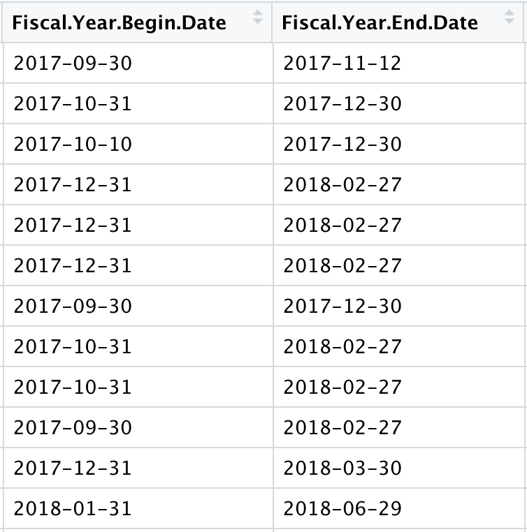

```{r setup, include=FALSE}
knitr::opts_chunk$set(dpi=300)
options(htmltools.dir.version = FALSE)
```

```{r xaringan-themer, include=FALSE}
# sds::duo_smith()
sds::mono_light_smith()
```

# Reminders

* Lab solutions posted on Perusall
* Extra credit due Wednesday
* Mini-Project due Wednesday 
* Quiz 2 review first 15 minutes of office hours on Wednesday
* Quiz 3 due Friday

---

# For Today

* File paths
* CSVs and other files types
* Reading files locally and from the Web
* Data cleaning strategies

---
class:small
# What is a working directory?

```{r}
getwd()
normalizePath(".")
normalizePath("..")
normalizePath("~")
```

---

# `R` Projects

* Associated with an `R` working directory
* Have their own workspace and history
* Can be associated with version control repository (e.g. Git)

---

# What is a CSV?

.pull-left[
* stands for comma-separated values
* separates rows by a return/enter
* separates columns by a comma
* often contains a header row
* open format (not tied to proprietary software)
]

.pull-right[
dog_name, date, score

Madison, 1/2/1990, 5

Skip, 3/4/1990, 4

Cooper, 4/5/1990, 6
]


---

# Read Lines of Data from a CSV

```{r message=FALSE, warning=FALSE}
library(readr)

pioneer_valley_census <- read_lines("datasets/pioneer_valley_census.csv")

head(pioneer_valley_census)
```

---

# Importing Data from a CSV

```{r message=FALSE, warning=FALSE}
library(dplyr)
library(readr)

hospital_costs_2018 <- read_csv("datasets/Hospital_Cost_Report_2018.csv")

hospital_costs_2018 %>%
  select(c(1:2)) %>%
  head()
```


---

# Relative Paths

* Absolute paths list all folders from your `root` folder to the location of the file
  * Avoid this! With different file systems, this may work on your computer, but not when you share with classmates or me
* Relative paths direct to the desired file from your *current location*
  * Move up a directory: `../`
  * Move up two directories: `../`
  * Move up a directory and into `datasets` folders: `../datasets/`

---

# Reading Data in from Excel


> What do we need to note about the following dataset?


---

# Reading Data in from Excel

```{r}
library(readr)

grad_rates <- readxl::read_excel("datasets/gradrates.xlsx", 
                                 skip = 1)

grad_rates %>%
  select(1) %>%
  head()
```

---

# Reading Data in from URL

```{r message=FALSE, warning=FALSE}
library(readr)

hospital_costs_2018 <- read_csv("https://raw.githubusercontent.com/SDS-192-Intro/SDS-192-public-website/main/slides/datasets/Hospital_Cost_Report_2018.csv")

hospital_costs_2018 %>%
  select(c(1:2)) %>%
  head()
```

---

# Importing Tips

* Data should be rectangular!
  * No merged columns/rows
  * Values in every cell
* Avoid Excel and other proprietary formats
* Avoid spaces in column names if possible

---

# Speaking of which...

```{r message=FALSE, warning=FALSE}
library(readr)

hospital_costs_2018 <- read_csv("datasets/Hospital_Cost_Report_2018.csv", 
               name_repair = make.names)

hospital_costs_2018 %>%
  select(c(1:3)) %>%
  head()
```

---

# Repairing Names

* If spaces in column name, must refer to in backticks: \`Column name with spaces\`
* With `name_repair = make.names`, `R` will convert each punctuation mark and space to a period

---

# Cleaning up data types

> What do you notice about the following output?

```{r message=FALSE, warning=FALSE}
library(readr)

hospital_costs_2018  <- read_csv("datasets/Hospital_Cost_Report_2018.csv", 
                                 name_repair = make.names)

hospital_costs_2018 %>%
  select(Total.Salaries..adjusted.:Contract.Labor) %>%
  head()
```

---

# `mutate()` for data cleaning

* We can use the `mutate()` data wrangling function to fix some issues with columns in our data frames
* Remember that `mutate()` creates a new column based on criteria we provide
* We can use `mutate()` to overwrite columsn with cleaned up data 

---

# Cleaning up data types

```{r message=FALSE, warning=FALSE}
library(stringr) # Package for string manipulation

hospital_costs_2018  <- 
  hospital_costs_2018  %>%
  mutate(Total.Salaries..adjusted. = str_replace_all(Total.Salaries..adjusted., "[$,]", "")) %>%
  mutate(Total.Salaries..adjusted. = as.numeric(Total.Salaries..adjusted.))

hospital_costs_2018 %>%
  select(Total.Salaries..adjusted.:Contract.Labor) %>%
  head()
```

---

# Do I really have to do this for every column with these issues in the dataset?!

* No.
* Reference for mutating multiple columns [here](https://dplyr.tidyverse.org/reference/mutate_all.html)

---

# Parsing Dates

* Dates can be converted to a date format using the `lubridate` package
* Step 1: Check how dates are formatted
* Step 2: Find corresponding conversion code on `lubridate` cheatsheet

.pull-left[

 
]

.pull-right[


]

---

# What format is this date?

```{r message=FALSE, warning=FALSE}
prison_boundaries <- read_csv("https://raw.githubusercontent.com/SDS-237-Data-Ethnography-Spring-22/group-project/main/checkpoints/datasets/Prison_Boundaries.csv")

prison_boundaries %>%
  select(SOURCEDATE, VAL_DATE) %>%
  head()
```


---

# Parsing Dates

```{r message=FALSE, warning=FALSE}
library(lubridate) # Package for working with dates

prison_boundaries  <- 
  prison_boundaries  %>%
  mutate(SOURCEDATE = ymd_hms(SOURCEDATE),
         VAL_DATE = ymd_hms(VAL_DATE))

prison_boundaries %>%
  select(SOURCEDATE,VAL_DATE) %>%
  head()
```

---

# Converting to `NA`

```{r message=FALSE, warning=FALSE}
prison_boundaries %>%
  select(POPULATION, CAPACITY) %>%
  head()
```

---

# Converting to `NA`

```{r message=FALSE, warning=FALSE}
prison_boundaries <- 
  prison_boundaries %>%
  mutate(POPULATION = na_if(POPULATION, -999), 
         CAPACITY = na_if(CAPACITY, -999))

prison_boundaries %>%
  select(POPULATION, CAPACITY) %>%
  head()
```

