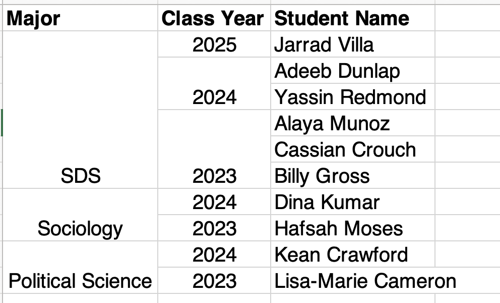
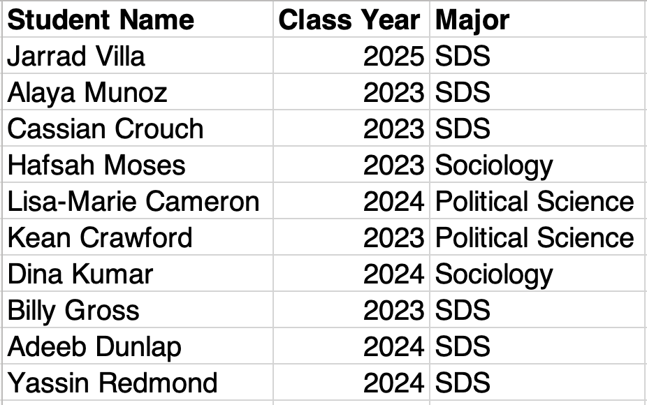

```{r setup, include=FALSE}
options(htmltools.dir.version = FALSE)
```

```{r xaringan-themer, include=FALSE}
# sds::duo_smith()
sds::mono_light_smith()
```

  
<iframe src="https://embed.polleverywhere.com/free_text_polls/Nf8vsh5yTcyyZiL0L288b?controls=none&short_poll=true" width="800px" height="600px"></iframe>

---

<iframe src="https://embed.polleverywhere.com/free_text_polls/BchPiUkGiXhxX63D66l3M?controls=none&short_poll=true" width="800px" height="600px"></iframe>

---

<iframe src="https://embed.polleverywhere.com/free_text_polls/Fc6KeV85w9tyVmOYtZAv9?controls=none&short_poll=true" width="800px" height="600px"></iframe>

---

<iframe src="https://embed.polleverywhere.com/free_text_polls/YQVPtpG4rYmIKrKY44pTk?controls=none&short_poll=true" width="800px" height="600px"></iframe>

---

<iframe src="https://embed.polleverywhere.com/free_text_polls/cUCKeTVu7yPKAQ2KhEm3p?controls=none&short_poll=true" width="800px" height="600px"></iframe>

---

# What is a dataset?

.pull-left[


Grolemund, Garrett, and Hadley Wickham. n.d. R for Data Science. Accessed March 31, 2019. https://r4ds.had.co.nz/.

]

.pull-right[

* a collection of data points organized into a structured format
* in this course, we will mainly work with datasets that are structured in a  two-dimensional format
* we will refer to these as *rectangular* datasets
  * rectangular datasets are organized into a series of rows and columns; ideally:
    * we refer to rows as *observations*
    * we refer to columns as *variables*
]
---

# Observations vs. Variables vs. Values

.right-column[

* Observations refer to individual units or cases of the data being collected.
  * If I was collecting data about each student in this course, one student would be an observation.
  * If I was collecting census data and aggregating it at the county level, one county would be an observation. 
* Variables describe something about an observation. 
  * If I was collecting data about each student in this course, 'major' might be one variable.
  * If I was collecting county-level census data, 'population' might be one variable.
* Values refer to the actual value associated with a variable for a given observation. 
  * If I was collecting data about each student's major in this course, one value might be SDS.
]

.left-column[


Grolemund, Garrett, and Hadley Wickham. n.d. R for Data Science. Accessed March 31, 2019. https://r4ds.had.co.nz/.

]
  
---

# How can we refer to certain rows, columns, or values in a dataset?

.right-column[

* An *index* is a formal way of identifying the data at certain positions in a dataset.
* Indexes are usually formatted as two numbers in brackets (e.g. [3,4]). 
* The first number refers to the row's position in the dataset. The second number refers to the column's position in the dataset.
  * [3,4] will refer to the value three rows down and four rows over.
* We can refer to an entire row of data by leaving the value in the second position of the index blank (e.g. [3,] will refer to the third row.)
* We can refer to an entire column of data by leaving the value in the first position of the index blank (e.g. [,4] will refer to the fourth column)
  * Alternatively, we can refer to a column by its column name. 
]

.left-column[


Grolemund, Garrett, and Hadley Wickham. n.d. R for Data Science. Accessed March 31, 2019. https://r4ds.had.co.nz/.

]
  
---

# Key Considerations for Rectangular Datasets

.pull-left[


Grolemund, Garrett, and Hadley Wickham. n.d. R for Data Science. Accessed March 31, 2019. https://r4ds.had.co.nz/.

]

.pull-right[

* All rows in a rectangular dataset are of equal length.
* All columns in a rectangular dataset are of equal length. 
* Let's say I have a rectangular dataset documenting student names and majors, and I was missing major information for one student. What would this look like in a rectangular dataset?

]
---

# Is this dataset rectangular?

> Please use 'yes'/'no' buttons in Zoom to respond. 

```{r echo=FALSE, out.width=700}

```

---

# Is this dataset rectangular?

> Please use 'yes'/'no' buttons in Zoom to respond. 

```{r echo=FALSE, out.width=700}

```

---

# How do I find out more information about a dataset?

* Metadata can be referred to as "data about data"
* Metadata provides important contextual information to help us interpret a dataset.
* There are two types of metadata associated with datasets:

* Administrative metadata tells us how a dataset is managed and its *provenance*, or the history of how it came to be in its current form:
    * Who created it?
    * When was it created?
    * When was it last updated?
    * Who is permitted to use it?  
* Descriptive metadata tells us information about the contents of a dataset:
    * What does each row refer to?
    * What does each column refer to?
    * What values might appear in each cell?

---

# Where do I find metadata for a dataset?

* Oftentimes metadata is recorded in a dataset codebook or data dictionary.
* These documents provide definitions for the observations and variables in a dataset and tell you the accepted values for each variable. 
* Let's say that I have a dataset of student names, majors, and class years. A codebook or data dictionary might tell me that:
  * Each row in the dataset refers to one student.
  * The 'Class Year' variable refers to "the year the student is expected to graduate."
  * Possible values for the 'Major' variable are Political Science, SDS, and Sociology. 

---

<iframe src="https://embed.polleverywhere.com/free_text_polls/DtwfO2yS2pJUi5vyvf0jg?controls=none&short_poll=true" width="800px" height="600px"></iframe>

---

# Exercise

* In break-out rooms, open the worksheet linked under today's announcements tab on our Course Schedule. 
* In your groups, follow the prompts and discuss each question. 

---

# Data Ethics in this Course

The three following conjectures inform my approach to data ethics:

1. Data is not "out there" or "given" but generated by individuals and institutions that hold particular assumptions and commitments. 
2. Because data science has historically been exclusionary, narrow worldviews have been at the helm in deciding what goes into data collection and analysis. This means that other assumptions and worldviews are often not considered in data. 
3. There are both benefits and harms to data collection that are often not equitably distributed amongst diverse social groups. 

With this in mind, every week, we will set aside time to consider the following questions:

1. What assumptions and commitments informed the design of this dataset?
2. Who has had a say in data collection and analysis regarding this dataset? Who has been excluded?
3. What are the benefits and harms of this dataset, and how are they distributed amongst diverse social groups? 

---

# For Friday

* Optional: Post an article about a data ethics issue in our Slack channel and indicate which question on the previous slide you believe it addresses. Alternatively, you can respond to an article that another student posted. 
* Next time: Getting our Course Infrastructure Set-up

