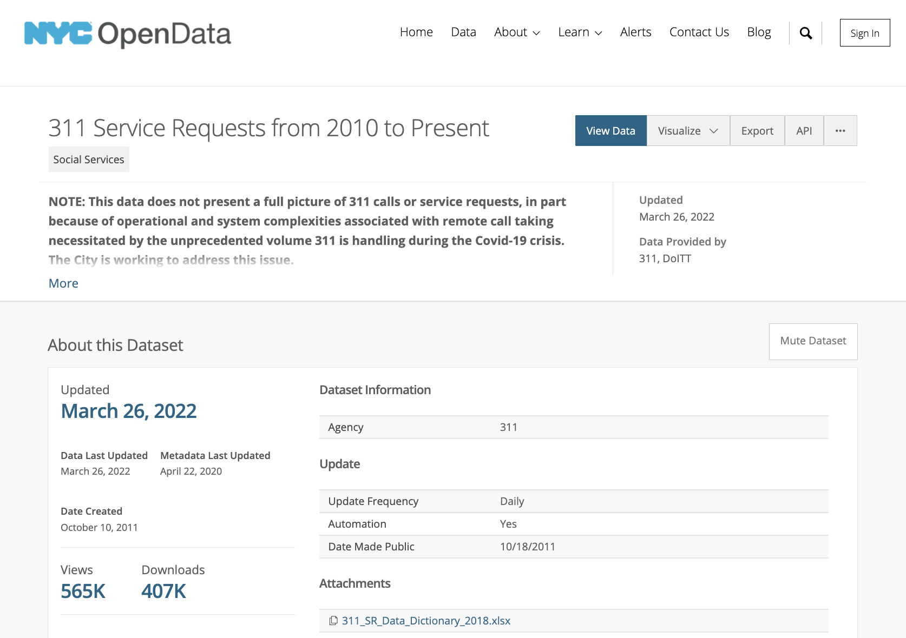
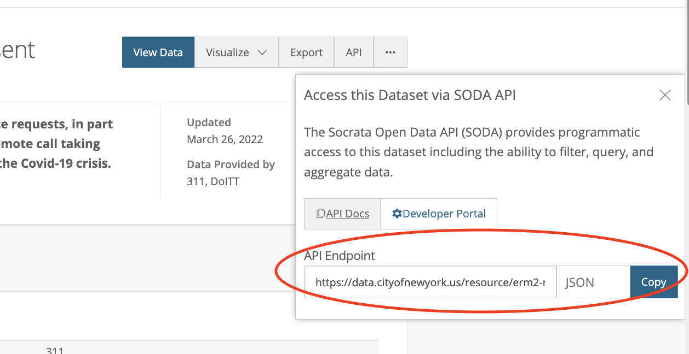
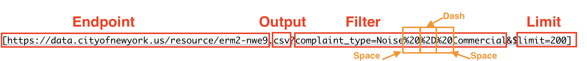

# For today

1. Code styling
2. API queries

---

# Code styling guidelines

* Styling makes code much easier to read
  * Why should we care?
* [Tidyverse Style Guide](https://style.tidyverse.org/index.html)

---

# File and object names

* File names should be meaningful
* File names shouldn't have spaces
* File names should only include `_` and/or `-` as characters

---

# Variable Names

* Variable names should be meaningful (e.g. not `data2`)
* Variable names should be lowercase 
* Variable names should separate words with `_` (i.e. snake case)
* Avoid using names of common functions (e.g. `sum` is not a great variable name)

---

# Spacing

* Add spaces after commas but not before (e.g. `(3, 2)`)
* No spacing around parentheses for function calls (e.g. not this: `paste ( "a", "b" ) `)
* Add spaces around operators like `+`, `<-`, and `==` (e.g `2 + 3` and `var == 3`)
  * ...but no space when using `$` to identify columns
* Add spaces before and after `%>%`

---

# New Lines

Place each piped function call on a new indented line:

```{r eval=FALSE}
df %>%
  group_by(var) %>%
  summarize(count = n())
```

If function arguments don't fit on one line, then put each on its own line:

```{r eval=FALSE}
df %>%
  summarize(
    count = n(),
    count_missing = sum(is.na(var)), 
    percent_missing = sum(is.na(var)) / n()
  )
```

---
# Commenting

* The mythology of "self-documenting" code 
* Context is critical to any coding practice!
* Comments should indicate:
  * Why a developer has opted to take a certain approach, 
  * how they came to know to take that approach, 
  * assumptions that they made in the process, 
  * shortcomings of the approach, and 
  * steps that might be taken to improve the code.
* Outline your thinking/working through process to other developers and your future self 

**Any code copied/modified from another source should be attributed to the individuals that wrote it via in-line comments. A link should be provided to the original code.**


---

# API

* Stands for Application Programming Interface
* Allows programmers or other systems (or users) to communicate with an online data service
* Clients (other programmers) expose part of the data service they've used to construct their databases
  * This is called an *endpoint*
  * Clients also publish documentation about how to communicate with the endpoint
* Users build URLs or HTTP services to request computer-readable data from the endpoint
  
---

# HTTP and GET Requests

* Hypertext Transfer Protocol (HTTP) is what enables communication between servers hosting web pages and browsers
* GET requests enable us to access a resource from a server (only receives data; doesn't change it on the server)
* Entering [https://smith.edu](https://smith.edu/) into a browser isssues a GET request to access the home page of the Smith website

---

# API Calls

.pull-left[
* Sends an HTTP request URI for a certain resource to a server
  * URI includes parameters about what data we wish receive and in what format (e.g. all colleges in MA in the format CSV)
* Servers send that information back via HTTP via response 
]

.pull-right[


> Figure: REST API - Author: Seobility - License: [CC BY-SA 4.0](https://www.seobility.net/en/wiki/Creative_Commons_License_BY-SA_4.0)]

---

# API Keys

* Many services require you to request and reference an API key before accessing data from their API
* Allows systems to track abuse of the service and sometimes limit requests
* Usually free
* API key gets included in call

---

# Motivating Example: NYC 311 Service Requests



---

# Constructing a Query

Base URL is the API Endpoint:[https://data.cityofnewyork.us/resource/erm2-nwe9.csv](https://data.cityofnewyork.us/resource/erm2-nwe9.csv)




---

# Filtering

[https://data.cityofnewyork.us/resource/erm2-nwe9.csv](https://data.cityofnewyork.us/resource/erm2-nwe9.csv)

* Filters appended after a `?`
* Multiple filters combined with `&`
* `$limit=` limits the number of rows downloaded to a certain number 

[https://data.cityofnewyork.us/resource/erm2-nwe9.csv?unique_key=10693408](https://data.cityofnewyork.us/resource/erm2-nwe9.csv?unique_key=10693408)

[https://data.cityofnewyork.us/resource/erm2-nwe9.json?complaint_type=Obstruction&$limit=100](https://data.cityofnewyork.us/resource/erm2-nwe9.json?complaint_type=Obstruction&$limit=100)

---

# API Documentation

* Indicates how to sign up for an API key
* Indicates possible output formats (e.g. CSV, JSON, XML, etc.)
* Lists field names and descriptions
* Provides example API calls
* Outlines error messages and solutions

> [https://dev.socrata.com/foundry/data.cityofnewyork.us/erm2-nwe9](https://dev.socrata.com/foundry/data.cityofnewyork.us/erm2-nwe9)

---

# Spaces and Special Characters

Internet protocols don't know how to interpret spaces or other special characters (i.e. non-ASCII), so we replace those characters with special codes that they do recognize:

* space ` `:	%20
* `!`:	%21
* `"`:	%22
* `%`:	%25
* `'`:	%27
* `-`: %2D

There are many resources online for identifying these. 

---

# Example Request with Special Characters

[https://data.cityofnewyork.us/resource/erm2-nwe9.csv?complaint_type=Noise%20%2D%20Commercial&$limit=200](https://data.cityofnewyork.us/resource/erm2-nwe9.csv?complaint_type=Noise%20%2D%20Commercial&$limit=200)




---

# Reading API Output into R

* When API data can be output as a CSV, the URL can be provided directly into `read_csv()`

```{r message=FALSE, warning=FALSE}
library(readr)
nyc_recent_noise <- read_csv("https://data.cityofnewyork.us/resource/erm2-nwe9.csv?complaint_type=Noise%20%2D%20Commercial&$limit=200")
head(nyc_recent_noise)
```


