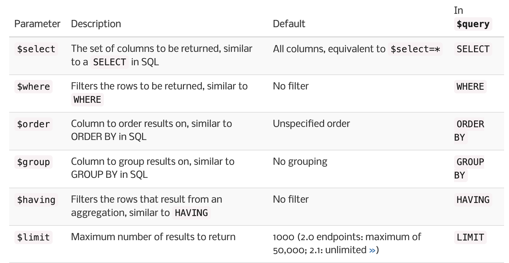

# For today

1. Intro to SQL
2. Complex API Queries

---

# What is a relational database?

* Series of tables (or rectangular datasets!)
* Every table has an ID field for each unit of observation (row)
* IDs are referenced to map relations across related tables 
* Access data from individual tables or across multiple tables with Structured Query Language (SQL)

---

.pull-left[

# `dplyr`

* `select()`
* `filter()`
* `group_by()`
* `arrange()`
* `head()`
]

.pull-right[

# `SQL`

* `SELECT`
* `WHERE`
* `GROUP BY`
* `ORDER BY`
* `LIMIT`
]

---

# `SQL` in APIs

* Different flavors of `SQL` can be written in the URLs constructed for API calls
* Example: NYC 311 open data 
  * Hosted on Socrata - software for creating a database platform that many state and municipal governments use to publish open datasets
  * Socrata's API provides functionality for the Socrata Query Language (SoQL) - a flavor of SQL
  
---

# `SoQL`

---

# Let's practice!

