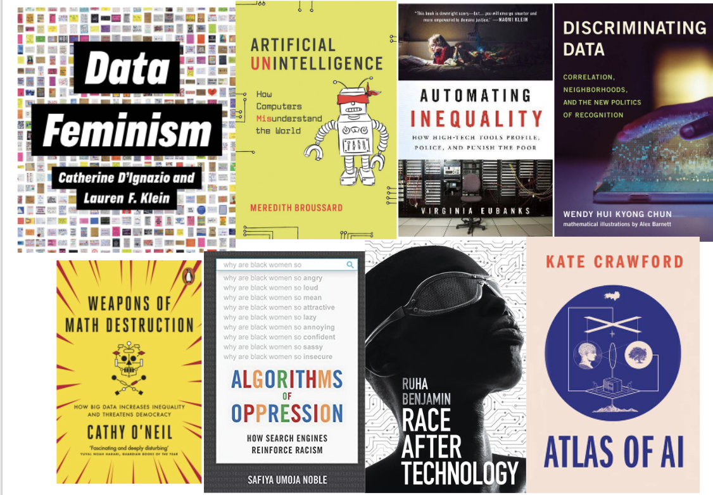

class: middle, center
# What's in a name?

---

# The amazing people working on algorithmic bias

```{r echo=FALSE, out.width= 600}

```

...and many more!

---

# AI Harms

```{r echo=FALSE, out.width= 300}
knitr::include_graphics("https://assets-global.website-files.com/5e027ca188c99e3515b404b7/5e1d064373c54c0416c38756_Group.jpg")
```

> Image from [Algorithmic Justice League](https://www.ajl.org/about); Credit: Megan Smith (former Chief Technology Officer of the USA)

---

# Fairness and Disparate Error

<iframe width="560" height="315" src="https://www.youtube.com/embed/UG_X_7g63rY" title="YouTube video player" frameborder="0" allow="accelerometer; autoplay; clipboard-write; encrypted-media; gyroscope; picture-in-picture" allowfullscreen></iframe>

---

# How does this happen?

* Garbage in, garbage out
* Proxy discrimination
* Data Bias Diversion

---

# Garbage In, Garbage Out...

...indicates instances when we build algorithms and other automated technologies on unrepresentative data. 

<iframe width="560" height="315" src="https://www.youtube.com/embed/Ts35luE59d0" title="YouTube video player" frameborder="0" allow="accelerometer; autoplay; clipboard-write; encrypted-media; gyroscope; picture-in-picture" allowfullscreen></iframe>

---

# Proxy Discrimination

.pull-left[
* Healthcare algorithm designed to determine which patients are in need of extra care
* Researchers determined that at a given risk score, black patients tended to be much sicker than white patients
* Algorithm used the amount of money patients had spent on healthcare as an indicator of health risk

> What's the problem?

]

.pull-right[

> Obermeyer, Ziad, Brian Powers, Christine Vogeli, and Sendhil Mullainathan. 2019. "Dissecting Racial Bias in an Algorithm Used to Manage the Health of Populations." Science 366 (6464): 447–53. https://doi.org/10.1126/science.aax2342.


]

---

class: middle, center


---

# Predicting Child Neglect

* Allegheny County PA Office of Child Youth and Families designed algorithm to predict when children were at higher risk of experiencing neglect
* Aims to address bias in neglect determinations
* Upon report, AFST scores likelihood (1-20) of neglect
* 131 predictive indicators based on regression analysis of data warehouse with over a billion records on past victims of neglect, including:
  * receiving county health or mental health treatment; 
  * being reported for drug or alcohol abuse; 
  * accessing supplemental nutrition assistance program benefits, cash welfare assistance, or Supplemental Security Income; 
  * living in a poor neighborhood;
  * interacting with the juvenile probation system

---

# Proxy Discrimination

* Assumes that bias happens in the screening phase, when studies show bias in referral stage
* No actual data on neglect so algorithm relies on proxies
* A quarter of the indicators are also indicators for poverty 
  * Data about use of public services is more widely accessible so included more than private services
  * No indicators for private rehabs or mental health counseling 
* Algorithm "oversamples" the poor

---

# The Data Bias Diversion

* Belief that it is possible and desirable to do data science in a "neutral" or impartial way
* Ignores:
  * We can't have datasets without making decisions regarding what counts and how. 
  * Data landscapes are already inequitable. 
  * Data science tools and methods have racist legacies. 
  * "Models are opinions reflected in mathematics." - Cathy O'Neil


---

# Data Ethics Frameworks

* [Federal Data Strategy](https://resources.data.gov/assets/documents/fds-data-ethics-framework.pdf)
* [Algorithmic Justice League Equitable AI](https://assets.website-files.com/5e027ca188c99e3515b404b7/5e332b739c247f30b4888385_AJL%20101%20Final%20_1.22.20.pdf)
* [Design Justice Principles](https://designjustice.org/read-the-principles)
* [Deon Data Ethics Checklist](https://deon.drivendata.org/)


