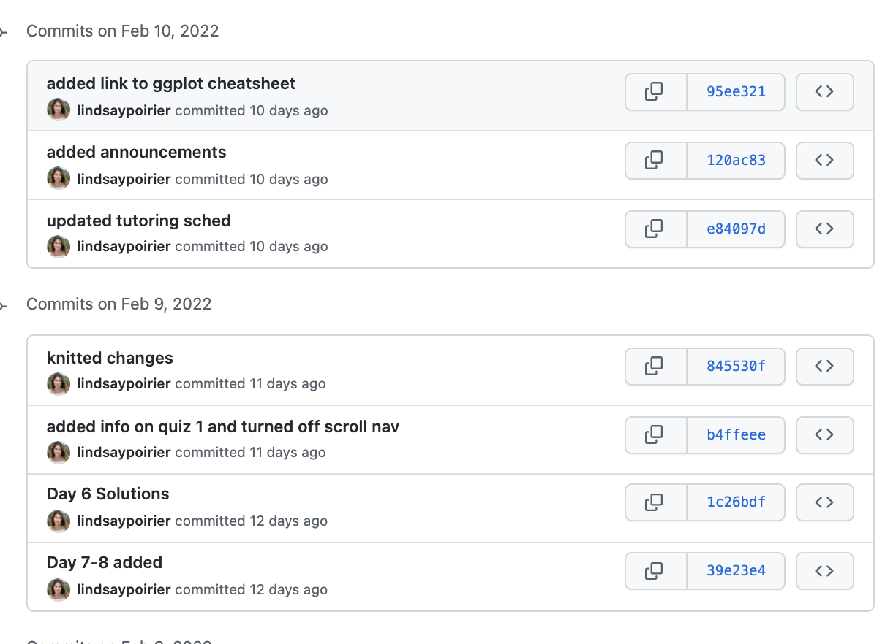
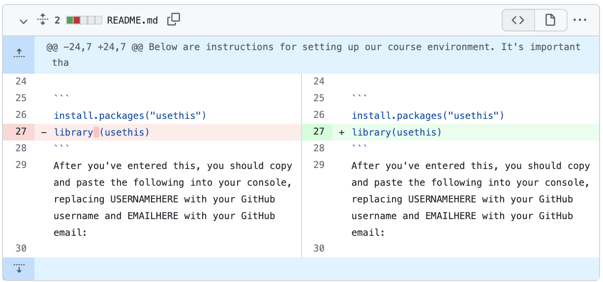

```{r setup, include=FALSE}
knitr::opts_chunk$set(dpi=300)
options(htmltools.dir.version = FALSE)
library(tidyverse)
```

```{r xaringan-themer, include=FALSE}
# sds::duo_smith()
sds::mono_light_smith()
```

---

# For Today

* Version Control
* GitHub

---

# Version Control

* Allows us to save and refer to versions of digital documents over time
* Supports "reproducibility" by allowing us to retrace our steps in a systematic way

* Example: My CV folder
* Example: Google Docs
* Example: Our course website

> Why is version control important?

---

.pull-left[
## Git
* Open source command line tool for version control
* Installed on your local machine (OS-specific)
* Does not require the use of any external tools
]

.pull-right[
##GitHub
* Web-hosting platform for `git` projects
* Hosts repositories for publishing/sharing work with the broader coding community
]

> These tools are complementary!

---

# Commits

.pull-left[
* In the language of `git` commits are saves to a digital document. 
  * A commit is a stored snapshot of the document at that time. 
  * Includes a unique hash that allows you to track the history of changes to the document.
  * When you commit, you create a commit message where you document your changes. 
  * Commit messages should be descriptive of the changes made
]
.pull-right[

]

---

# Diff

.pull-left[
* On committing, we can review the differences between the previous and current version of a document
* Additions are highlighted in green and deletions are highlighted in red. 

]
.pull-right[



]

---

# Why are we using GitHub in this course?

* Ensures that that all files needed to run a project are compiled together (i.e. reproducibility)
* Allows easy collaboration and file sharing between classmates
* Allows public code to be licensed so that others know how they may use it
* Readmes, issues, etc. 

---

# GitHub Workflow

* Step 1: **Pull** changes from GitHub (remote) to your machine (local)
* Step 2: Make changes on  your computer
* Step 3: **Commit** changes 
  * Do this often and leave descriptive commit messages!
* Step 4: **Pull** changes from remote again again if working with others. (Why do you think we should do this?)
* Step 5: **Push** changes from machine (local) to GitHub (remote)

---

# GitHub Vocabulary

* Fork: Create a copy of a GitHub repository for editing in your own user account
* Clone: Download a copy of a remote repository to your local machine
* Pull: Fetch changes to code from a remote repository to local machine
* Stage: Select the files you wish to commit changes on
* Diff: Review the differences between different versions of files
* Commit: Take a snapshot of changes to files
* Push: Upload changes to code from local machine to remote repository

---

# Collaboration on GitHub

* GitHub assigns permissions to different users to manage and make changes to files stored in a GitHub repository
* Separate users can clone a repo to their local machine to make changes at the same time.  
* They don't necessarily know what changes the other is making!
* This is why pulling often is so important! 
  * There may be a different version of a file in GitHub by the time you go to push your changes. 
  


---

# Collaboration Challenges

* 

* What happens when two users have cloned a GitHub repo to their local machine are making changes to that repo in the same place at the same time?


---

# Data Ethics Questions

1. What assumptions and commitments informed the design of this dataset? 
2. Who has had a say in data collection and analysis regarding this dataset? Who has been excluded?
3. What are the benefits and harms of this dataset, and how are they distributed amongst diverse social groups? 

---

# Data Import

Today, for lecture, I'm going to ask that you just follow along. You will have an opportunity to practice this in today's lab. 

```{r include=FALSE}
library(spotifyr)
id <- Sys.getenv("SPOTIFY_CLIENT_ID")
secret <- Sys.getenv("SPOTIFY_CLIENT_SECRET")
Sys.setenv(SPOTIFY_CLIENT_ID = id)
Sys.setenv(SPOTIFY_CLIENT_SECRET = secret)
access_token <- get_spotify_access_token()
```

```{r}
artist <- get_artist_audio_features(artist = "Janelle Monae") %>%
  select(-c(album_images, artists, available_markets))
```

---

# Distribution of Danceability

.pull-left[
```{r eval = FALSE}
ggplot(artist, aes(x = danceability)) +
  geom_histogram()
```

> What does this message mean?

]
.pull-right[
```{r echo=FALSE}
ggplot(artist, aes(x = danceability)) +
  geom_histogram()
```
]


---

# Distribution of Danceability

.pull-left[
* Binwidth indicates the width of the buckets we'd like to categorize our data into.
* Bins indicates the number of bins to create. 
* We choose one or the other when creating histograms. 
]
.pull-right[
```{r}
ggplot(artist, aes(x = danceability)) +
  geom_histogram(binwidth = 0.1, color = "white")
```
]

---

# Labels for this plot

.pull-left[
```{r eval=FALSE}
ggplot(artist, aes(x = danceability)) +
  geom_histogram(binwidth = 0.1, color = "white") +
  labs(title = "Distribution of Danceability of Songs by Janelle Monáe, Spotify, 2022", 
       x = "Danceability", 
       y = "Count of Songs")
```

> How would we describe this distribution?

]
.pull-right[
```{r echo=FALSE}
ggplot(artist, aes(x = danceability)) +
  geom_histogram(binwidth = 0.1, color = "white") +
  labs(title = "Distribution of Danceability of Songs by Janelle Monáe, Spotify, 2022", 
       x = "Danceability", 
       y = "Count of Songs")
```
]


---

# Acousticness

.pull-left[
```{r eval=FALSE}
ggplot(artist, aes(x = acousticness)) +
  geom_histogram(binwidth = 0.1, color = "white") +
  labs(title = "Distribution of Acousticness of Songs by Janelle Monáe, Spotify, 2022", 
       x = "Acousticness", 
       y = "Count of Songs")
```

> How would we describe this distribution?
> How would I compare this across Janelle Monáe's albums?

]
.pull-right[
```{r echo=FALSE}
ggplot(artist, aes(x = acousticness)) +
  geom_histogram(binwidth = 0.1, color = "white") +
  labs(title = "Distribution of Acousticness of Songs by Janelle Monáe, Spotify, 2022", 
       x = "Acousticness", 
       y = "Count of Songs")
```
]

---

# Faceting a Histogram

.pull-left[
```{r eval=FALSE}
ggplot(artist, aes(x = danceability)) +
  geom_histogram(binwidth = 0.1, color = "white") +
  labs(title = "Distribution of Danceability of Songs by Janelle Monáe, Spotify, 2022", 
       x = "Danceability", 
       y = "Count of Songs") +
  facet_wrap(vars(album_name))
```

> What do we learn from this plot?

]
.pull-right[
```{r echo=FALSE}
ggplot(artist, aes(x = danceability)) +
  geom_histogram(binwidth = 0.1, color = "white") +
  labs(title = "Distribution of Danceability of Songs by Janelle Monáe, Spotify, 2022", 
       x = "Danceability", 
       y = "Count of Songs") +
  facet_wrap(vars(album_name))
```
]


---

# Frequency of Key Modes

.pull-left[
```{r eval=FALSE}
ggplot(artist, aes(x = key_mode)) +
  geom_bar() +
  coord_flip()
```
]
.pull-right[
```{r echo=FALSE}
ggplot(artist, aes(x = key_mode)) +
  geom_bar() +
  coord_flip()
```
]

---

# Labels for this plot

.pull-left[
```{r eval=FALSE}
ggplot(artist, aes(x = key_mode)) +
  geom_bar() +
  coord_flip() +
  labs(title = "Frequency of Key Modes in Songs by Janelle Monáe", 
       x = "Key Mode", 
       y = "Count of Songs")
```

> How might I compare this across Janelle Monáe's albums?

]
.pull-right[
```{r echo=FALSE}
ggplot(artist, aes(x = key_mode)) +
  geom_bar() +
  coord_flip() +
  labs(title = "Frequency of Key Modes in Songs by Janelle Monáe", 
       x = "Key Mode", 
       y = "Count of Songs")
```
]

---

# Stacked Bar Plots

> Note `fill = ` gets used for polygons, and `col = ` gets used for points and lines. 

.pull-left[
```{r eval=FALSE}
ggplot(artist, aes(x = key_mode, fill = album_name)) +
  geom_bar() +
  coord_flip() +
  labs(title = "Frequency of Key Modes in Songs by Janelle Monáe", 
       x = "Key Mode", 
       y = "Count of Songs", 
       fill = "Album Name") +
  scale_fill_brewer(palette = "Dark2")
```

> How might I compare this across Janelle Monáe's albums?
Sys.getenv()
]
.pull-right[
```{r echo=FALSE}
ggplot(artist, aes(x = key_mode, fill = album_name)) +
  geom_bar() +
  coord_flip() +
  labs(title = "Frequency of Key Modes in Songs by Janelle Monáe", 
       x = "Key Mode", 
       y = "Count of Songs", 
       fill = "Album Name") +
  scale_fill_brewer(palette = "Dark2")
```
]


---

# Dodging 

> Note `fill = ` gets used for polygons, and `col = ` gets used for points and lines. 

.pull-left[
```{r eval=FALSE}
ggplot(artist, aes(x = key_name, fill = album_name)) +
  geom_bar(position = "dodge") +
  coord_flip() +
  labs(title = "Frequency of Key Modes in Songs by Janelle Monáe", 
       x = "Key Mode", 
       y = "Count of Songs", 
       fill = "Album Name") +
  scale_fill_brewer(palette = "Dark2")
```
]
.pull-right[
```{r echo=FALSE}
ggplot(artist, aes(x = key_name, fill = album_name)) +
  geom_bar(position = "dodge") +
  coord_flip() +
  labs(title = "Frequency of Key Modes in Songs by Janelle Monáe", 
       x = "Key Mode", 
       y = "Count of Songs", 
       fill = "Album Name") +
  scale_fill_brewer(palette = "Dark2")
```
]

---

# Converting to a Percentage Scale

> Setting the position to "fill" converts the scale of the y-axis to a percentage.

.pull-left[
```{r eval=FALSE}
ggplot(artist, aes(x = key_name, fill = album_name)) +
  geom_bar(position = "fill") +
  coord_flip() +
  labs(title = "Key Modes in Songs by Janelle Monáe", 
       x = "Key Mode", 
       y = "Percentage of Songs", 
       fill = "Album Name") +
  scale_fill_brewer(palette = "Dark2")
```
]
.pull-right[
```{r echo=FALSE}
ggplot(artist, aes(x = key_name, fill = album_name)) +
  geom_bar(position = "fill") +
  coord_flip() +
  labs(title = "Key Modes in Songs by Janelle Monáe", 
       x = "Key Mode", 
       y = "Percentage of Songs", 
       fill = "Album Name") +
  scale_fill_brewer(palette = "Dark2")
```
]

---

# For Wednesday

* Quiz 1
* No reading

