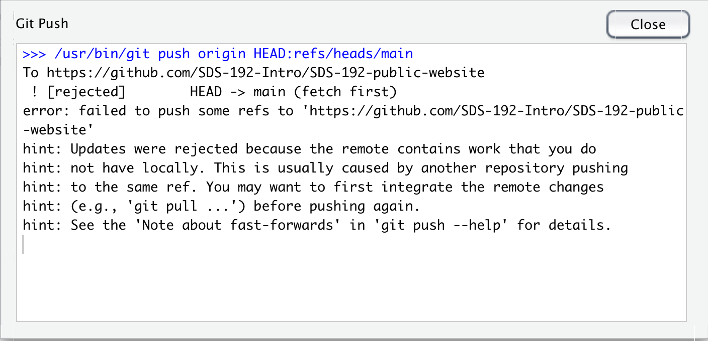

```{r setup, include=FALSE}
knitr::opts_chunk$set(dpi=300)
options(htmltools.dir.version = FALSE)
library(tidyverse)
```

```{r xaringan-themer, include=FALSE}
# sds::duo_smith()
sds::mono_light_smith()
```

---

# For Today

* Version Control
* GitHub

---

# Version Control

* Allows us to save and refer to versions of digital documents over time
* Supports "reproducibility" by allowing us to retrace our steps in a systematic way

* Example: My CV folder
* Example: Google Docs
* Example: Our course website

> Why is version control important?

---

.pull-left[
## Git
* Open source command line tool for version control
* Installed on your local machine (OS-specific)
* Does not require the use of any external tools
]

.pull-right[
##GitHub
* Web-hosting platform for `git` projects
* Hosts repositories for publishing/sharing work with the broader coding community
]

> These tools are complementary!

---

# Commits

.pull-left[
* In the language of `git` commits are saves to a digital document. 
  * A commit is a stored snapshot of the document at that time. 
  * Includes a unique hash that allows you to track the history of changes to the document.
  * When you commit, you create a commit message where you document your changes. 
  * Commit messages should be descriptive of the changes made
]
.pull-right[

]

---

# Diff

.pull-left[
* On committing, we can review the differences between the previous and current version of a document
* Additions are highlighted in green and deletions are highlighted in red. 

]
.pull-right[


]

---

# Why are we using GitHub in this course?

* Ensures that that all files needed to run a project are compiled together (i.e. reproducibility)
* Allows easy collaboration and file sharing between classmates
* Allows public code to be licensed so that others know how they may use it
* Readmes, issues, etc. 

---

# GitHub Workflow

* Step 1: **Pull** changes from GitHub (remote) to your machine (local)
* Step 2: Make changes on  your computer
* Step 3: **Commit** changes 
  * Do this often and leave descriptive commit messages!
* Step 4: **Pull** changes from remote again again if working with others. (Why do you think we should do this?)
* Step 5: **Push** changes from machine (local) to GitHub (remote)

---

# GitHub Vocabulary

* Fork: Create a copy of a GitHub repository for editing in your own user account
* Clone: Download a copy of a remote repository to your local machine
* Pull: Fetch changes to code from a remote repository to local machine
* Stage: Select the files you wish to commit changes on
* Diff: Review the differences between different versions of files
* Commit: Take a snapshot of changes to files
* Push: Upload changes to code from local machine to remote repository

---

# Collaboration on GitHub

* GitHub assigns permissions to different users to manage and make changes to files stored in a GitHub repository
* Separate users can clone a repo to their local machine to make changes at the same time.  
* They don't necessarily know what changes the other is making!
* This is why pulling often is so important! 
  * There may be a different version of a file in GitHub by the time you go to push your changes. 
  
---

# Push Error


> This error indicates that you don't have the latest version of the files on your local machine. You should pull, then push again.  

---

# Collaboration Challenges

* What happens when two users have cloned a GitHub repo to their local machine and are making changes to that repo in the same place at the same time?
* When pushing you will get an error indicating that there is a *merge conflict*.
* `git` wants to know which version of the file you prefer - yours or your collaborators. 
* You have to manually resolve these conflicts in an editor. 

---


