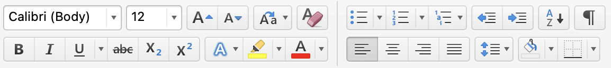
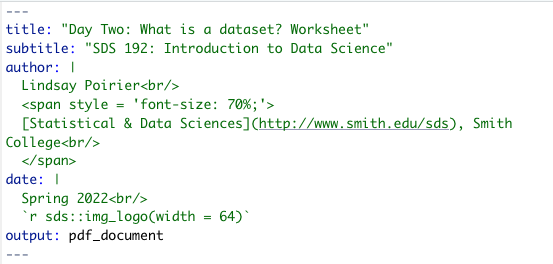
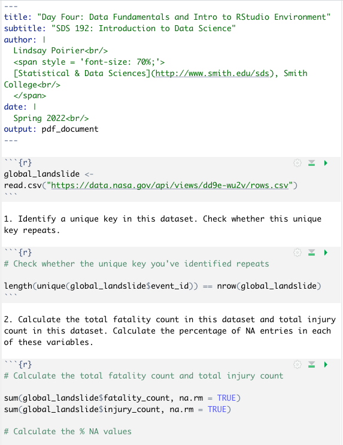
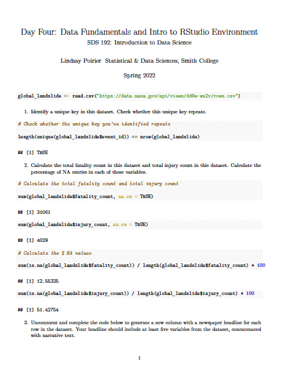
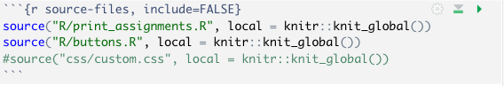
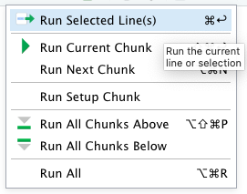
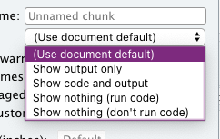
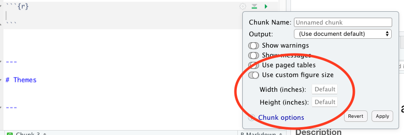

```{r setup, include=FALSE}
knitr::opts_chunk$set(dpi=300)
options(htmltools.dir.version = FALSE)
```

```{r xaringan-themer, include=FALSE}
# sds::duo_smith()
sds::mono_light_smith()
```

---

# For Today

* RMarkdown
  * YAML
  * Syntax
  * Figures
  * Code Folding

---

# What is R Markdown?

<iframe src="https://player.vimeo.com/video/178485416?h=8a57bf9b88&color=428bca" width="640" height="400" frameborder="0" allow="autoplay; fullscreen; picture-in-picture" allowfullscreen></iframe>
<p><a href="https://vimeo.com/178485416">What is R Markdown?</a> from <a href="https://vimeo.com/rstudioinc">RStudio, Inc.</a> on <a href="https://vimeo.com">Vimeo</a>.</p>

---

.pull-left[
## R Script
* Contain bare code for defining objects and running scripts
* All code in a file typically run at once from start to finish
]

.pull-right[
## R Markdown
* Includes features for writing reports and producing web pages with code
* Enables the author to style output in particular ways
* Modular: code snippets can be run one at a time in chunks
]

---

# R Markdown Scripting

* Text in R Markdown files is written in the Markdown markup language
* Markup languages communicate to a digital system how we want text and images displayed on the screen
* Allows us to assign certain words as headers, specify bullets, create tables, etc.
* Computational way of formatting text that we might otherwise format through WYSIWYG


---

# YAML

.pull-left[
* Metadata provided at the top of a R Markdown file
* Indicates how the file should be formatted
* Surrounded by `---`s
]
.pull-right[

]

---


# Knitting

* Renders a document based on the metadata and syntax presented in Markdown 
* Many different formats:
  * Slideshow presentations 
  * PDF Documents
  * Word documents
  * Web pages (`HTML`)
  * Etc. 

---

# Example

.pull-left[

]

.pull-right[

]


---

# Code Chunks

.pull-left[
* Executable chunks of code are surrounded by <code>```</code>s
* We can insert R code as well as other languages
* We can run all code chunks from start to finish, or individually
* Ordering is important!]

.pull-right[



]
---

# Code Chunks, cont.


.pull-left[
* `include = FALSE` code runs; but code and output don't appear in the final document
* `echo = FALSE` code runs and output appears in final document; but code doesn't appear in final document
* `message = FALSE` hides messages from the code in final output
* `warning = FALSE` hides warnings from the code in final output
]
.pull-right[

> We don't always want to display our code in the final output. We don't even always want to display the output of our code in the final output. 


]

---

# Headers

.pull-left[

```
# Header 1

## Header 2

### Header 3

...

###### Header 6
```
]

.pull-right[

# Header 1

## Header 2

### Header 3

...

###### Header 6

]

---

# Images and Hyperlinks

.pull-left[ 

```


[here](www.about.com)

```
]

.pull-right[


[here](www.about.com)
]

---

# Styling

.pull-left[


\*Check this out!\*

\*\*Check this out!\*\*

\~\~Check this out!\~\~


]

.pull-right[

*Check this out!*

**Check this out!**

~~Check this out!~~

]

---

# Bullets and Numbering

.pull-left[

```

1. Part 1
  a. Part 1a
2. Part 2
3. Part 3

- Part 1
  - Part 1a
- Part 2
- Part 3

```
]

.pull-right[

1. Part 1
  a. Part 1a
2. Part 2
3. Part 3

- Part 1
  - Part 1a
- Part 2
- Part 3

]

---


# Inline Code


.pull-left[

```

This is output from code 
written in `R`: 

`3+3`

`sum(3, 7)`

`paste("Part", 3+3, 
sep = " ")`

```

]

.pull-right[

This is output from code written in `R`: 

`3+3`

`sum(3, 7)`

`paste("Part", 3+3, sep = " ")`

]

  
---

.pull-left[
# Code Folding

```

---
title: "Code Folding"
output:
  html_document:
    code_folding: hide
---

```
]

.pull-right[
# Table of Contents

```
---
title: "Table of Contents"
output:
  html_document:
    toc: true
    toc_depth: 2
---

```

]


---

# Figure Options


.pull-left[
## Default for Page

```
---
title: "Figure Sizing"
output:
  html_document:
    fig_width: 7
    fig_height: 6
    fig_caption: true
---
```
]

.pull-right[

## Individual Figures

]


---

# Themes

```
---
title: "This will specify the theme of an HTML page"
output:
  html_document:
    theme: united
    highlight: tango
---
```

> See all themes and highlight styles at [https://bootswatch.com/3/](https://bootswatch.com/3/).


